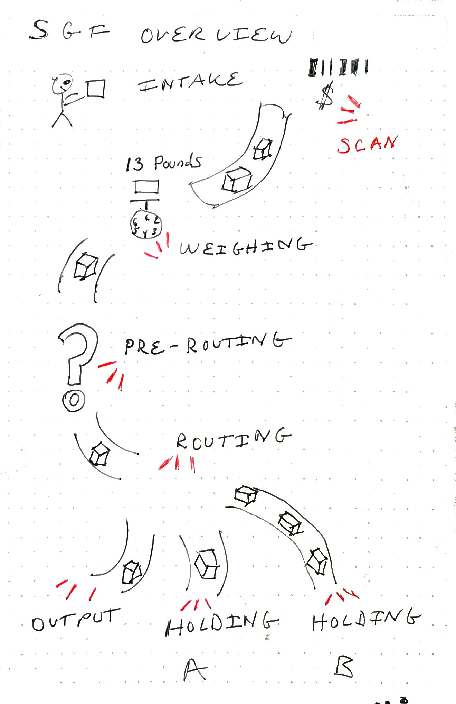
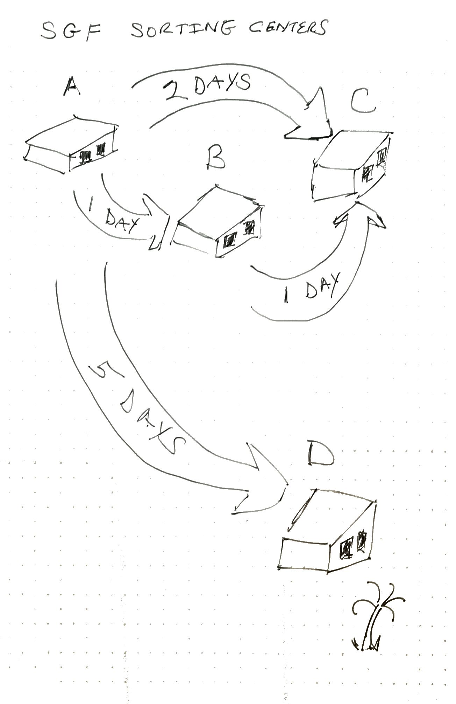
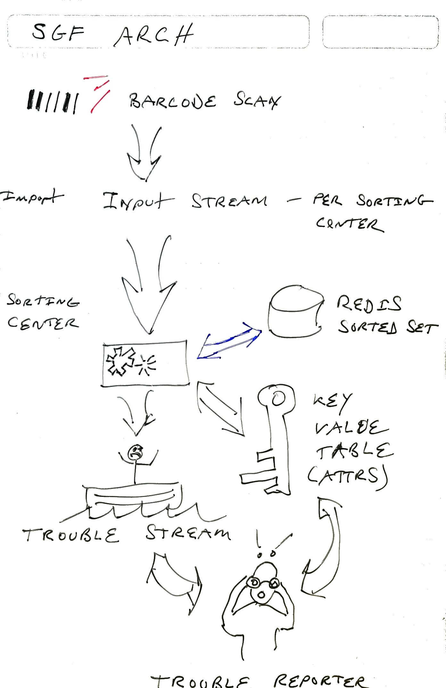

# SGF - Speedy Goods Freight

dell-unbounded-hackathon-2021 project

SGF is a parcel delivery service that prides itself on fast delivery with a money-back guarantee for late or lost packages.  To provide the fastest service possible they run the package conveyor system at their sorting centers at high speed. Sometimes packages fly off the conveyor and are lost.  These lost or delayed packages decrease company profits because they must refund the shipping cost, and sometimes the actual value of the package, to the customer.

The IT department at SGF has been assigned the task of finding a way to alert sorting center workers to missing packages before they become excessively delayed or completely lost.  Additionally, C-suite executives want to see real-time package handling metrics, including a running account of lost packages, late deliveries and locations within sorting centers  where delays tend to occur.

## Package processing flow

When customers drop their packages off at any of the four SGF sorting centers they declare the value of their packages. SGF applies a barcode and the package is scanned by the `intake` scanner. The package travels to a weighing station, where it is weighed and scanned again. After weighing, the package travels through pre-routing and routing scanners.  If the package will be delivered to a local destination, it is sent to the output area where it undergoes its final `delivery` scan. Otherwise the package is routed to one of three other holding areas before being placed onto a truck for transportation to the destination sorting center.



Trucks travel between sorting centers, once per hour. Trucks carry all the packages that have arrived in their respective holding area within the previous hour.

SGF has four sorting centers distributed across the country A, B, C and D. The travel time between the sorting centers varies by distance




## Package tracking system capabilities

To meet company needs, the package tracking system must provide the following functionality:

1. Detect when packages have fallen off a conveyor belt within a sorting center, so that they can be located and placed back into the package flow in a timely manner
2. Detect when packages are completely lost, so that the value of the package can be refunded to the customer
3. Detect when packages are delivered late, so that the shipping cost can be refunded to the customer
4. Provide a public facing package tracking interface that shows top-level package events for individual packages (entry and exit of sorting centers, delivery date and time)
5. Provide an internal facing package tracking interface that shows all package events for individual packages
6. Calculate the count, total weight and total value of packages loaded on each truck for each trip
7. Calculate the running average of package count and value per sorting center to determine liability insurance requirements and required staffing levels
8. Calculate the running average of lost or delayed packages by sorting center and by conveyor belt section to prioritize system maintenance

In this hackathon project, only functions 1 to 3 have been completed. Functions 4 and 5 can be finished by adding a UI to read from existing data tables. Functions 6 to 8 require additional processing stream code

## Non-functional requirements

SGF operates four sorting centers, each of which has its own computing facility. SGF also has a central computing facility that handles public facing tracking requests and SGF internal reporting.

* Sorting Center processing should operate independently from other sorting centers so that delayed package alerts can continue to function during an internet outage
* The package tracking interface collects a minimal number events - only sorting center enter and exit events. These events can be maintained by the central computing facility
* The volume of packages handled at sorting centers is very high. Packages travel quickly from scanner to scanner, generating high volume, time-sensitive flow of events. IT staff have determined that a traditional relational database is unable to keep up with the stream of events while also retaining historical tracking events. Therefore the staff have selected to use [Pravega](https://pravega.io/) to accumulate barcode scan events and to store package attributes such as value and weight.

## Hackathon simulation limitations

Barcode scanning events are pre-generated by a simulation program and subsequently written into individual input streams (one per sorting-center)

To simplify the development tasks for the hackathon we make the following assumptions:

* Packages are considered to be received when they reach the intake scanner at the first sorting center they reach and delivered when they reach the output holding area of the final sorting center. We do not track last mile pickup or delivery in this simulation.
* Any given package will travel through at most two sorting centers
* There will be four sorting centers
* Each sorting center has the following barcode scanners:
  * pre-routing
  * routing
  * holding A, B, C (when routing to remote centers)
  * output (local delivery)
* Packages enter a sorting center in one of two ways:
  * when receiving packages from customers: intake scan followed by a weighing scan 
  * when receiving packages from other sorting centers: receiving scan followed by pre-routing
* Typically packages take between 1 to 5 days to be delivered, but the simulation will only run for a few minutes
* The total number of simulated packages can be varied, along with the number of delayed and lost packages
* Packages are not scanned on trucks. Instead the holding scan and the receiving scan will be used to determine when a package is on a truck
* There are unlimited number of trucks that depart for remote sorting centers once per hour and always arrive 'on time'. The time to travel between individual sorting centers is fixed, but depends on origin and destination. e.g. from center A to C - 48 hours, from A to B - 24 hours, etc.
* The simulator will fabricate a specified number of lost packages, most of which will be found 'late' and some of which will never be found. This will generate lost package events in sorting centers and lost/late deliveries that must be refunded to the customer

# Solution proposal

Pravega is applied to solve SGFs package tracking problem

## Problem detection method


### Detect when packages have fallen off a conveyor belt within a sorting center, so that they can be located and placed back into the package flow, Detect when packages are lost

When packages are scanned, events are sent to the sorting center input stream with these elements:

* timestamp
* package id
* barcode scanner id
* next destination barcode scanner id
* expected next barcode scan time

A per-sorting center processing task will:

* record the package id and its expected next barcode scan time an a redis  sorted set
* append the event to a key-value-table keyed on package id
* if the barcode scanner id is an intake, receiving, output or holding scan then it will append a copy of the event in the central public tracking key-value-table, keyed on package id
* if the barcode scanner id is an intake scan, it will calculate the expected delivery time and save the package id, declared value and estimated delivery time in a package attribute key-value-table, keyed on package id
* if the barcode scanner id is the weighing scanner, it will add the package weight to the package attribute key-value-table
* if the barcode scanner id is an output scanner, it will mark use the package attribute key-value-table to determine if the package was delivered late
* packages that fail to "scan" within the expected next barcode scan time are reported as delayed. They are also added to a "late" redis hash indicating their next expected scanner location. A later scan of the package id clears them from the hash
* periodically the "late" redis hash is checked to determine if a package is still delayed past its expected delivery time, in which case it is reported as lost

Delayed and lost packages events are written to a 'trouble' stream from which a reporting process can alert sorting center staff, perform metrics calculations outlined in the capability list, etc

### Provide an internal facing package tracking interface that shows all package events for individual packages

The reporting interface demonstrates this for lost packages

## Solution Architecture

An overview of the solution architecture is shown below. 

* Per-sorting center input streams receive events from barcode scanners placed at key locations in the facility. 
* Per-sorting center processes read the tail of the input stream to detect various conditions are previously described
* A Redis sorted set keeps track of next expected scanning event. 
* When a scanning event is missed, a delivery is late or a package is lost, an event is written to the trouble stream
* The Trouble Reporter process tails the trouble stream. It hydrates trouble events with additional information from the package attribute key-value table before passing the events on to users



## Unimplemented or partially implemented features

* Calculate the count, total weight and total value of packages loaded on each truck - When packages arrive in a holding area, they can be added to a per-truck stream. At the 'next hour' mark the stream would be closed. The count, weight and value will be calculated from all packages in that truck's stream and a summary report can be written to another stream that tracks truck metrics
* Calculate the running average of package count and value per sorting center to determine liability insurance requirements and required staffing levels
* Calculate the running average of lost or delayed packages by sorting center and by conveyor belt section
* Provide a public facing package tracking interface that shows top-level package events for individual packages (entry and exit of sorting centers, delivery date and time)


# Operation
How to use this software to demonstrate Pravega functionality

Follow these steps to try out the software:

1. Generate a stream of events using the simulator_cli
2. Start Pravega docker image in standalone mode or provide an existing Pravega cluster
3. Start redis docker image or provide an existing redis server
4. Import simulated events into individual sorting center streams using import_event
5. Run one sorting_center process for each of the four sorting centers (run them in parallel)
6. Run the trouble_reporter to see a 'tidy' stream of problem reports created by combining data from the 'trouble' stream and package-attribute key-value-table

Note that you can start steps 5, and 6 and then import data (step 4) as well

## Simulator CLI

The simulator Cli is used to generate a stream of json events on stdout. These events  must be sorted on key `event_time` before ingesting into Pravega

```shell
usage: simulator_cli.py [-h] [-s SIMULATED_RUN_TIME] [-i INTAKE_RUN_TIME]
                        [-p PACKAGE_COUNT] [-d DELAYED_PACKAGE_COUNT]
                        [--lost_package_count LOST_PACKAGE_COUNT] [-t] [-j]
                        [-l {info,warn,debug,error,fatal,critical}]

optional arguments:
  -h, --help            show this help message and exit
  -s SIMULATED_RUN_TIME, --simulated_run_time SIMULATED_RUN_TIME
                        total simulated running time (minutes, real-world
                        time, e.g. 1440 = 1 day)
  -i INTAKE_RUN_TIME, --intake_run_time INTAKE_RUN_TIME
                        total simulated running time to intake packages
                        (minutes)
  -p PACKAGE_COUNT, --package_count PACKAGE_COUNT
                        total number of packages to be simulated
  -d DELAYED_PACKAGE_COUNT, --delayed_package_count DELAYED_PACKAGE_COUNT
                        total number of packages to be delayed
  --lost_package_count LOST_PACKAGE_COUNT
                        total number of packages to be lost enroute (must be
                        less than delayed_package_count)
  -t, --test            run simulation test
  -j, --json_output     output json
  -l {info,warn,debug,error,fatal,critical}, --console_log_level {info,warn,debug,error,fatal,critical}
                        set logging level for console output:
                        info,warn,debug,error,fatal,critical
```


Example: intake 1000 packages in 8 simulated hours, then continue generating events for 6 days, delaying 20 packages. Of those 20 packages, 5 will be completely lost, write the sorted json stream to a file for later ingestion into Pravega using `import_events.py`


```shell
$ python simulator_cli.py -t --package_count 1000 --intake_run_time 480 --simulated_run_time 10080 --delay 20 --lost 5 -j | jq -sc 'sort_by(.event_time)[]'  > /tmp/events.json
```

The `jq` tool is used to sort and ensure the generated output is one complete json object per text line, e.g.:

```json
{"estimated_delivery_time":1621138133,"event_time":1621046333,"next_scanner_id":"weighing","scanner_id":"intake","next_event_time":1621046573,"destination":"C","declared_value":38,"package_id":"1","sorting_center":"B"}
{"estimated_delivery_time":1621138161.8,"event_time":1621046361.8,"next_scanner_id":"weighing","scanner_id":"intake","next_event_time":1621046601.8,"destination":"A","declared_value":73,"package_id":"2","sorting_center":"B"}
{"estimated_delivery_time":1621483790.6,"event_time":1621046390.6,"next_scanner_id":"weighing","scanner_id":"intake","next_event_time":1621046630.6,"destination":"C","declared_value":46,"package_id":"3","sorting_center":"D"}
{"estimated_delivery_time":1621138219.3999999,"event_time":1621046419.3999999,"next_scanner_id":"weighing","scanner_id":"intake","next_event_time":1621046659.3999999,"destination":"C","declared_value":32,"package_id":"4","sorting_center":"B"}
```

## Start Pravega docker image

Run the pravega docker image, specify the ip address of the host interface in the `HOST_IP` environment variable

```shell
$ docker run -it --rm -e HOST_IP=192.168.198.4 -p 9090:9090 -p 12345:12345 pravega/pravega:latest standalone
```

## Start Redis docker image

```shell
$ docker run -it --rm -p 6379:6379 redis
```

## Importing simulated events into Pravega

Events generated by the simulator must be imported into Pravega. The import_events module imports events as serialized dictionaries into one of 4 streams (one for each sorting center)

```shell
$ export CLASSPATH=`pwd`/jar/\*:/home/bkc/src/3rdParty/pravega-client-0.9.0/\* 
$ jython import_events.py -u  tcp://192.168.198.4:9090 --scope test -i /tmp/events.json --purge_scope --purge_redis --rs localhost -l debug
```

Because jython takes a long time to start, the import_events module  supports `--purge_scope` and `--purge_redis` options that remove previous simulation data from Pravega and Redis

## Run sorting center process

Run four copies of the sorting center process simultaneously. One each for sorting center A, B, C and D

```shell
$ export CLASSPATH=`pwd`/jar/\*:/home/bkc/src/3rdParty/pravega-client-0.9.0/\* 
$ jython sorting_center.py -r -u tcp://localhost:9090 --scope test --rs localhost --wait_for_events --mark 1000 -l debug -s A &
$ jython sorting_center.py -r -u tcp://localhost:9090 --scope test --rs localhost --wait_for_events --mark 1000 -l debug -s B &
$ jython sorting_center.py -r -u tcp://localhost:9090 --scope test --rs localhost --wait_for_events --mark 1000 -l debug -s C &
$ jython sorting_center.py -r -u tcp://localhost:9090 --scope test --rs localhost --wait_for_events --mark 1000 -l debug -s D &
```

## Run the trouble reporting tool

```shell
$ export CLASSPATH=(pwd)/jar/\*:/home/bkc/src/3rdParty/pravega-client-0.9.0/\* 
$ jython trouble_reporter.py -u  tcp://192.168.198.4:9090 --scope test  --rs localhost -l debug --wait  -r
```


# Debugging and testing tools

Additional Resources that were used during development and investigation of Pravega

## kvt_test

The `tools/kvt_test.py` module provides a cli for testing table creation, insertion and retrieval of a key and value.

### write a value

```shell
$ env CLASSPATH=/path-to-client-jars/pravega-client-0.9.0/\* jython kvt_test.py -l debug -u tcp://192.162.108.4:9090 --scope test --table_name test --key test --value 1
```

Writes both key and value as strings. Unfortunately I could not get this to work using JavaSerializer for either key or value

### read a value

```shell
$ env CLASSPATH=/path-to-client-jars/pravega-client-0.9.0/\* jython kvt_test.py -l debug -u tcp://192.162.108.4:9090 --scope test --table_name test --key test 
2021-05-15 11:34:59,822 root         DEBUG    kvt table test/test already exists
u'1'
```


## pravega_util - remove streams and tables from scope, delete keys from redis

To delete all kvt and streams from a scope and also delete keys from redis:

```shell
$ env CLASSPATH=(pwd)/jar/\*:/home/bkc/src/3rdParty/pravega-client-0.9.0/\* jython pravega_util.py -u  tcp://192.168.198.4:9090 -l debug --purge_redis --rs localhost --purge_scope --scope test 
```

Note that `import_events` also supports the `--purge_scope` and `--purge_redis` options

# Dependencies

These java dependencies are required

* https://github.com/redis/jedis - specifically https://repo1.maven.org/maven2/redis/clients/jedis/3.6.0/jedis-3.6.0.jar
* Pravega Client jar files for 0.9

